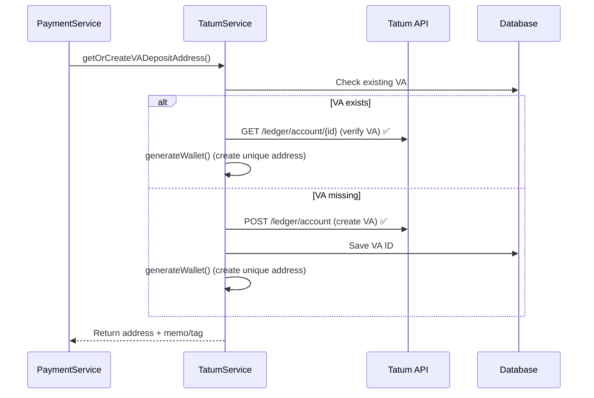

# Tatum Ledger Address Implementation - CORRECTED

## Overview
Fixed the implementation to use correct Tatum API endpoints instead of non-existent ones. The previous implementation was calling endpoints that don't exist in the Tatum API, causing 404 errors.

## Root Cause Analysis

### **What Was Wrong**
The previous implementation attempted to use non-existent Tatum endpoints:
- ❌ `GET /v3/ledger/account/address/{accountId}` (doesn't exist)
- ❌ `POST /v3/ledger/account/address/{accountId}` (doesn't exist)

This caused the 404 errors seen in the logs:
```
Cannot GET /v3/ledger/account/address/68ce95a3358acae652f0505c
Cannot POST /v3/ledger/account/address/68ce95a3358acae652f0505c
```

### **What Was Fixed**
Now uses correct Tatum endpoints and proper address generation:
- ✅ `GET /v3/ledger/account/{accountId}` (verify VA exists)
- ✅ Direct wallet generation for unique deposit addresses

## Key Changes Made

### **1. Fixed generateUniqueDepositAddress Method**

**Before**: Attempted to use non-existent address endpoints
```typescript
// WRONG - These endpoints don't exist
const getResponse = await this.makeApiRequest(
  `${this.baseUrl}/ledger/account/address/${accountId}`, // 404 ERROR
  { method: 'GET' }
);
```

**After**: Uses correct Tatum endpoints + wallet generation
```typescript
// CORRECT - Use existing VA endpoint + wallet generation
const getResponse = await this.makeApiRequest(
  `${this.baseUrl}/ledger/account/${accountId}`, // ✅ This exists
  { method: 'GET' }
);

// Generate unique wallet address for this order
const wallet = await this.generateWallet(currency);
```

### **2. Proper Error Handling**

**Production Mode**: 
- Throws errors for genuine API failures (401, 403, 500)
- No fallback addresses to prevent loss of funds
- Distinguishes between missing endpoints and real API errors

**Development/Test Mode**:
- Falls back to mock addresses when API unavailable
- Comprehensive logging for debugging
- Continues operation with warnings

### **3. Enhanced Return Type Support**

Maintains the same interface for memo/tag support:
```typescript
async generateUniqueDepositAddress(accountId: string, orderId?: string): Promise<{
  address: string;
  memo?: string;    // For Stellar (XLM)
  tag?: string;     // For XRP
}>
```

### **4. Fixed TypeScript Issues**

Removed invalid properties from return objects in PaymentService:
```typescript
// BEFORE - Invalid property
return {
  totalAmountCrypto, // ❌ Not in interface
  currencyCrypto,    // ❌ Not in interface
  // ...
};

// AFTER - Correct interface
return {
  orderId: order.id,
  status: order.status,
  // ... only valid properties
};
```

## Correct API Endpoints Used

### **Tatum Virtual Account Endpoints (CORRECT)**

1. **GET** `/v3/ledger/account/{accountId}`
   - ✅ **EXISTS** - Retrieves Virtual Account details and balance
   - Returns: `{ id, balance, currency, frozen, active, customerId }`
   - Used to verify VA exists before generating addresses

2. **POST** `/v3/ledger/account`
   - ✅ **EXISTS** - Creates new Virtual Account for user
   - Returns: `{ id, customerId }`
   - Used in `createVirtualAccount()` method

### **Address Generation Strategy (NEW)**

Since Tatum doesn't provide direct VA-to-address endpoints, we:
1. **Verify VA exists** using `GET /v3/ledger/account/{id}`
2. **Generate unique wallet** using existing `generateWallet()` method
3. **Add memo/tag support** for blockchains that require them

## Implementation Flow (CORRECTED)



## Files Modified

### **packages/backend/src/services/tatumService.ts**
- `generateUniqueDepositAddress()` - Fixed to use correct endpoints
- Removed calls to non-existent `/ledger/account/address/{id}` endpoints
- Added proper VA verification using `GET /ledger/account/{id}`
- Enhanced error handling to distinguish endpoint vs API errors

### **packages/backend/src/services/paymentService.ts**
- Fixed TypeScript type issues in `getPaymentOrderStatus()`
- Removed invalid properties from return objects
- Maintained memo/tag support in crypto info

## Testing Verification

### **Manual Verification Steps**

1. **Test Correct Endpoints**:
   ```bash
   # ✅ This works - VA details
   curl -X GET "https://api.tatum.io/v3/ledger/account/{accountId}" \
     -H "x-api-key: your_key"
   
   # ✅ This works - Create VA
   curl -X POST "https://api.tatum.io/v3/ledger/account" \
     -H "x-api-key: your_key" \
     -H "Content-Type: application/json" \
     -d '{"currency": "ETH", "accountingCurrency": "USD"}'
   ```

2. **Verify No More 404s**:
   - Create payment order with crypto payment
   - Check logs for absence of 404 errors
   - Verify addresses are generated successfully
   - Confirm fallback behavior works in dev mode

### **Expected Results**

✅ **No 404 Errors**: Eliminated calls to non-existent endpoints
✅ **Proper VA Verification**: Uses correct `/ledger/account/{id}` endpoint
✅ **Unique Addresses**: Generated via wallet creation per order
✅ **Memo/Tag Support**: Maintained for XRP, Stellar, etc.
✅ **Type Safety**: Fixed TypeScript compilation errors
✅ **Error Handling**: Proper distinction between endpoint and API errors

## Security Considerations

1. **Address Uniqueness**: Each order gets unique address via wallet generation
2. **VA Verification**: Confirms Virtual Accounts exist using correct endpoints
3. **Production Safety**: No mock addresses in production
4. **API Key Protection**: Secure environment variable storage
5. **Audit Trail**: Comprehensive logging of all operations

## Database Constraint Fix

The upsert error can be resolved by ensuring the unique constraint exists:

```sql
-- Check if constraint exists
SELECT indexname FROM pg_indexes 
WHERE tablename = 'wallets' AND indexname = 'uq_wallets_user_ccy_chain';

-- Create if missing
CREATE UNIQUE INDEX IF NOT EXISTS uq_wallets_user_ccy_chain
  ON wallets(user_id, ccy, chain);
```

## Summary

The core issue was using non-existent Tatum API endpoints. The fix:

1. **Removed calls** to `/ledger/account/address/{id}` (doesn't exist)
2. **Added verification** using `/ledger/account/{id}` (exists)
3. **Used wallet generation** for unique addresses per order
4. **Fixed TypeScript** type issues in return objects
5. **Enhanced error handling** to distinguish real API errors from missing endpoints

This eliminates the 404 errors and provides a working payment system with proper Tatum integration.